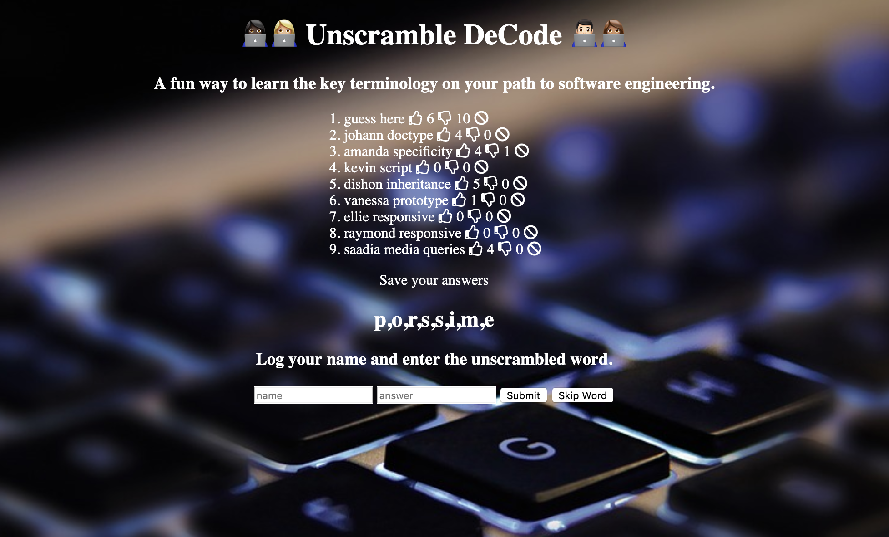

# deCodeThis-aWordGame

- Word Gaming App using **Express.js**, **Node.js**, and **MongoDB**.
- Some dependencies used: *EJS*, *Body-Parser*  
- **CRUD** functionality: Create ("post"), Read ("get"), Update ("put"), and Delete ("delete")

## How to Play

- Find the hidden (programming) words
- Log your name and answers
- Vote and remove other gamers' comments

## Installation

1. Clone repo
2. Open terminal
3. Change directory to deCodeThis-aWordGame folder
4. run `npm install`

## Usage

1. Run `node server.js`
2. In Browser, navigate to `localhost:3000`
